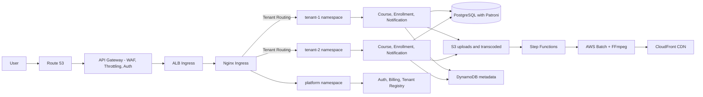
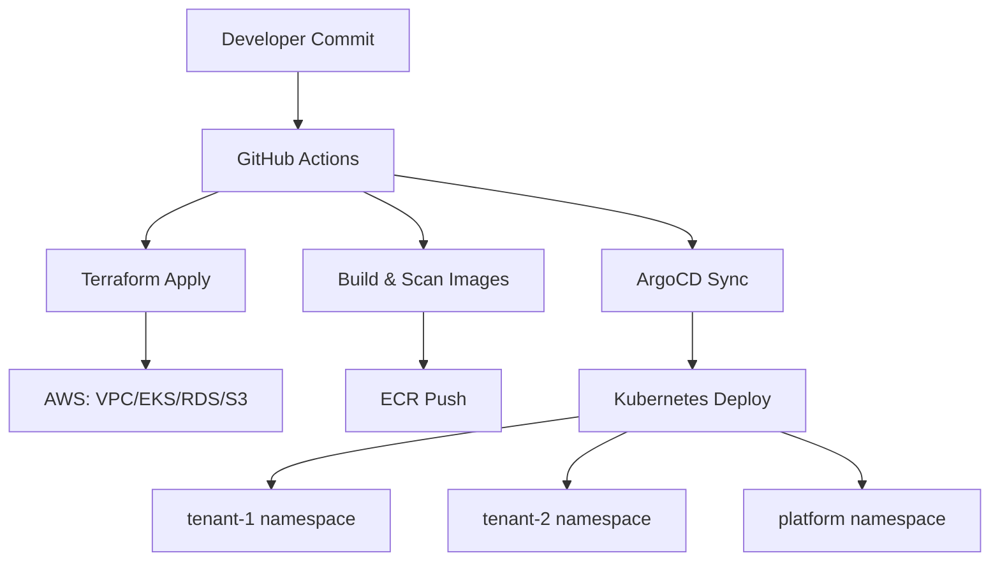
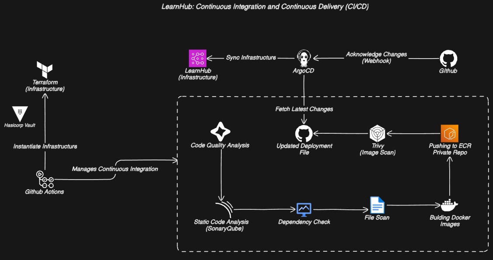

# LearnHub Architecture Documentation
**Modern SaaS Learning Platform on AWS with Kubernetes Multi-Tenancy**

---

## **Introduction**
LearnHub is a cloud-native Learning Management System (LMS) engineered for **scalability**, **multi-tenancy**, and **high availability**. Built on AWS with Kubernetes orchestration, it delivers isolated tenant environments, robust video processing, and automated failover capabilities.

---

## **Architecture Overview**

>Note: The above diagram provides a visual representation of the LearnHub architecture for better understanding.

### **Mermaid: High-Level Architecture**


---

## **Core Components**
### **1. Networking & Security**
| **Component**               | **Purpose**                                                                 |
|-----------------------------|-----------------------------------------------------------------------------|
| **VPC**                     | Segregated public/private subnets with security groups                      |
| **Route 53**                | DNS management and domain routing                                           |
| **API Gateway (Edge)**      | WAF, throttling, auth pre-checks, and routing to ALB                         |
| **EKS-Managed ALB**         | Traffic distribution to Kubernetes ingress endpoints                         |
| **Nginx Reverse Proxy**     | Tenant-aware routing to Kubernetes namespaces                               |

### **2. Kubernetes Cluster (EKS)**
| **Namespace**     | **Microservices**                           | **Tenant Isolation**                                  |
|-------------------|---------------------------------------------|-------------------------------------------------------|
| `tenant-1`        | Course, Enrollment, Notification, Transcoding | Dedicated resources via Kubernetes ResourceQuotas     |
| `tenant-2`        | Replica of tenant-1 services                | Network Policies for inter-namespace communication    |
| `platform`        | Auth, Billing, Tenant Registry              | Shared services with strict RBAC and namespace policies |

### **3. Data Layer**
| **Service**               | **Technology**    | **Configuration**                                  |
|---------------------------|-------------------|----------------------------------------------------|
| **Primary Database**      | PostgreSQL        | Patroni-managed primary with synchronous replication |
| **Standby Database**      | PostgreSQL        | Patroni-managed standby with automated failover    |
| **File Storage**          | S3                | `uploads-bucket` (raw) & `transcoded-bucket` (processed) |
| **Metadata Store**        | DynamoDB          | Signed URL generation with TTL                     |

### **4. Video Processing Pipeline**


---

## **Key Workflows**
### **1. Multi-Tenant Request Flow**
1. User → Route 53 → API Gateway (WAF, throttling, auth pre-checks)
2. API Gateway → ALB → Nginx ingress (tenant-aware routing)
3. Microservices interact with tenant-sharded databases (schema or database-per-tenant)

### **2. Video Transcoding Workflow**
1. Upload API writes to S3 `uploads-bucket`
2. S3 Event triggers `VideoTransformingStateMachine` (Step Functions)
3. AWS Batch processes video using FFmpeg containers
4. Output stored in `transcoded-bucket` with CloudFront CDN
5. DynamoDB stores metadata + signed URLs

### **3. High Availability Database**
- **Active-Passive PostgreSQL**:
  - Synchronous replication via Patroni-managed PostgreSQL
  - Automatic failover and leader election with Patroni
  - Read replicas for analytics workloads

---

## **Deployment Guide**
### **Prerequisites**
- AWS Account with IAM permissions for EKS, RDS, S3
- `eksctl`, `kubectl`, `aws-cli` installed
- Terraform v1.5+ (for infrastructure provisioning)

### **Infrastructure Setup**
```bash
# 1. Provision VPC/EKS Cluster
terraform apply -target=module.vpc -target=module.eks

# 2. Configure database
terraform apply -target=module.rds

# 3. Deploy Kubernetes services
helm install learnhub ./charts -f tenants.yaml
```

### **Mermaid: Deployment Flow**


### **Tenant Configuration**
`tenants.yaml`
```yaml
tenants:
  - name: tenant-1
    resources:
      requests:
        memory: "4Gi"
        cpu: "1000m"
    database:
      shard: "shard01"
  - name: tenant-2
    replicas: 3
    database:
      shard: "shard02"
```

---

## **CI/CD Pipeline**

LearnHub integrates a GitOps-based Continuous Integration and Continuous Delivery (CI/CD) pipeline to automate code quality checks, infrastructure provisioning, container security, and Kubernetes deployments.



### **Key Highlights**

* **Infrastructure as Code**:
  GitHub Actions triggers Terraform to provision cloud resources, securely injecting secrets via HashiCorp Vault.

* **Code Quality & Security Checks**:
  Uses **SonarQube** for static code analysis and **Trivy** for dependency and image scanning before deployment.

* **Container Lifecycle**:
  Docker images are built, scanned, and pushed to AWS ECR private repositories.

* **GitOps with ArgoCD**:
  ArgoCD fetches the latest deployment manifests from GitHub and syncs them to the Kubernetes cluster.

> This pipeline ensures secure, repeatable, and automated delivery of both infrastructure and application code.

---

## **Operational Excellence**
### **Security & Compliance**
- **Authentication/Authorization**: JWT claims map to tenant IDs; authorization enforced at ingress and service layers.
- **Secrets Management**: AWS Secrets Manager or Vault for database credentials and API keys.
- **Encryption**: S3 SSE-KMS and PostgreSQL at-rest encryption; TLS in transit across services.

### **Monitoring**
| **Tool**          | **Use Case**                                  |
|--------------------|----------------------------------------------|
| **CloudWatch**     | EKS cluster metrics & S3 bucket analytics    |
| **Prometheus**     | Microservice performance monitoring          |
| **AWS X-Ray**      | Distributed tracing of video pipeline        |

### **Disaster Recovery**
- **Database**: Cross-region replication with RDS Snapshots
- **S3 Buckets**: Versioning + Cross-Region Replication (CRR)
- **Kubernetes**: Cluster autoscaler with multi-AZ node groups

---

## **Contributing**
1. Fork repository & create feature branch (`git checkout -b feat/new-service`)
2. Submit PR with:
   - Architecture diagrams (using [lucidchart](https://app.diagrams.net/) and [eraser.io](https://app.eraser.io))
   - Terraform modules for new components
   - Helm chart updates
3. Adhere to [Gitflow workflow](https://www.atlassian.com/git/tutorials/comparing-workflows/gitflow-workflow)

---

## **License**
MIT License - See [LICENSE.md](LICENSE.md) for full terms.

> **Note**: Production deployments require configuring AWS Backup for RDS/S3 and enabling EKS control plane logging.
