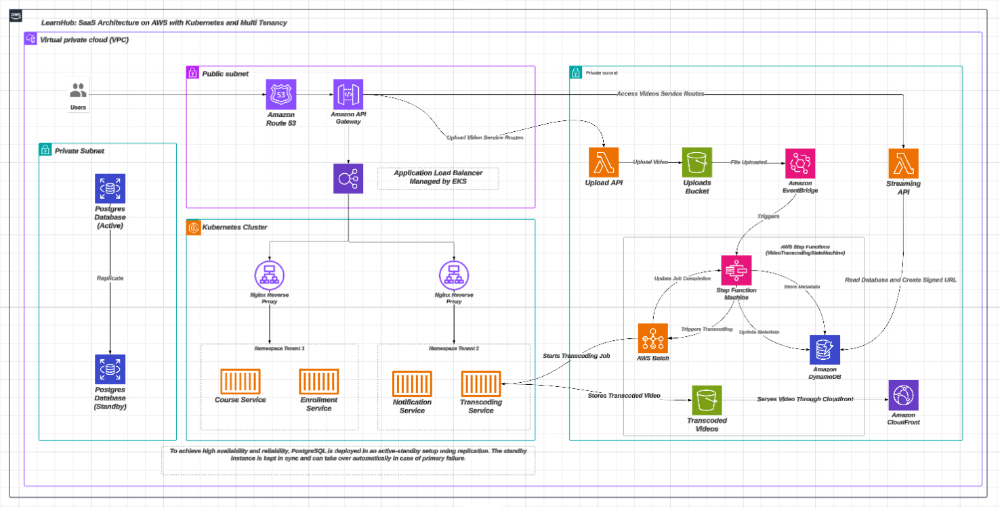
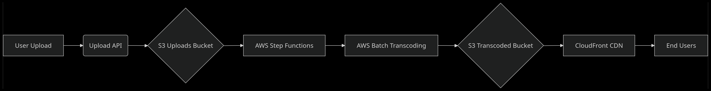

# LearnHub Architecture Documentation
**Modern SaaS Learning Platform on AWS with Kubernetes Multi-Tenancy**

---

## **Introduction**
LearnHub is a cloud-native Learning Management System (LMS) engineered for **scalability**, **multi-tenancy**, and **high availability**. Built on AWS with Kubernetes orchestration, it delivers isolated tenant environments, robust video processing, and automated failover capabilities.

---

## **Architecture Overview**

>Note: The above diagram provides a visual representation of the LearnHub architecture for better understanding.

---

## **Core Components**
### **1. Networking & Security**
| **Component**               | **Purpose**                                                                 |
|-----------------------------|-----------------------------------------------------------------------------|
| **VPC**                     | Segregated public/private subnets with security groups                      |
| **Route 53**                | DNS management and domain routing                                           |
| **EKS-Managed ALB**         | Traffic distribution to Kubernetes pods                                     |
| **Nginx Reverse Proxy**     | Tenant-aware routing to Kubernetes namespaces                               |

### **2. Kubernetes Cluster (EKS)**
| **Namespace**     | **Microservices**                           | **Tenant Isolation**                                  |
|-------------------|---------------------------------------------|-------------------------------------------------------|
| `tenant-1`        | Course, Enrollment, Notification, Transcoding | Dedicated resources via Kubernetes ResourceQuotas     |
| `tenant-2`        | Replica of tenant-1 services                | Network Policies for inter-namespace communication    |

### **3. Data Layer**
| **Service**               | **Technology**    | **Configuration**                                  |
|---------------------------|-------------------|----------------------------------------------------|
| **Primary Database**      | PostgreSQL        | Active instance with streaming replication         |
| **Standby Database**      | PostgreSQL        | Automatic failover via `pg_auto_failover`          |
| **File Storage**          | S3                | `uploads-bucket` (raw) & `transcoded-bucket` (processed) |
| **Metadata Store**        | DynamoDB          | Signed URL generation with TTL                     |

### **4. Video Processing Pipeline**


---

## **Key Workflows**
### **1. Multi-Tenant Request Flow**
1. User → Route 53 → API Gateway
2. ALB routes to tenant-specific namespace via Nginx ingress
3. Microservices interact with tenant-sharded databases

### **2. Video Transcoding Workflow**
1. Upload API writes to S3 `uploads-bucket`
2. S3 Event triggers `VideoTransformingStateMachine` (Step Functions)
3. AWS Batch processes video using FFmpeg containers
4. Output stored in `transcoded-bucket` with CloudFront CDN
5. DynamoDB stores metadata + signed URLs

### **3. High Availability Database**
- **Active-Passive PostgreSQL**:
  - Synchronous replication via `pglogical`
  - Automatic failover using `Patroni`
  - Read replicas for analytics workloads

---

## **Deployment Guide**
### **Prerequisites**
- AWS Account with IAM permissions for EKS, RDS, S3
- `eksctl`, `kubectl`, `aws-cli` installed
- Terraform v1.5+ (for infrastructure provisioning)

### **Infrastructure Setup**
```bash
# 1. Provision VPC/EKS Cluster
terraform apply -target=module.vpc -target=module.eks

# 2. Configure database
terraform apply -target=module.rds

# 3. Deploy Kubernetes services
helm install learnhub ./charts -f tenants.yaml
```

### **Tenant Configuration**
`tenants.yaml`
```yaml
tenants:
  - name: tenant-1
    resources:
      requests:
        memory: "4Gi"
        cpu: "1000m"
    database:
      shard: "shard01"
  - name: tenant-2
    replicas: 3
    database:
      shard: "shard02"
```

---

## **Operational Excellence**
### **Monitoring**
| **Tool**          | **Use Case**                                  |
|--------------------|----------------------------------------------|
| **CloudWatch**     | EKS cluster metrics & S3 bucket analytics    |
| **Prometheus**     | Microservice performance monitoring          |
| **AWS X-Ray**      | Distributed tracing of video pipeline        |

### **Disaster Recovery**
- **Database**: Cross-region replication with RDS Snapshots
- **S3 Buckets**: Versioning + Cross-Region Replication (CRR)
- **Kubernetes**: Cluster autoscaler with multi-AZ node groups

---

## **Contributing**
1. Fork repository & create feature branch (`git checkout -b feat/new-service`)
2. Submit PR with:
   - Architecture diagrams (using [lucid.io](https://app.diagrams.net/))
   - Terraform modules for new components
   - Helm chart updates
3. Adhere to [Gitflow workflow](https://www.atlassian.com/git/tutorials/comparing-workflows/gitflow-workflow)

---

## **License**
MIT License - See [LICENSE.md](LICENSE.md) for full terms.

> **Note**: Production deployments require configuring AWS Backup for RDS/S3 and enabling EKS control plane logging.
